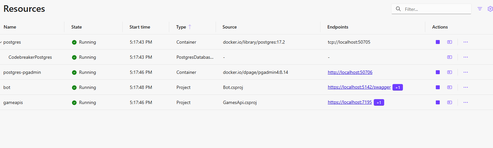

# Part 3 - .NET Aspire Integrations

The 03-Start folder contains the result solution from part 2.

Docker Desktop or Podman is required!

> Add a database to the Games API

## Prepare the solution

You can use these NuGet packages:

- CNinnovation.Codebreaker.Cosmos
- CNinnovation.Codebreaker.SqlServer
- CNinnovation.Codebreaker.Postgres (preview)

The PostgreSQL package is available on this feed:

```xml
    <add key="codebreaker" value="https://pkgs.dev.azure.com/cnilearn/codebreakerpackages/_packaging/codebreaker/nuget/v3/index.json" />
```

The other CNinnovation packages are available on NuGet!

Add these Aspire Packages to the games API:

- Aspire.Npsql.EntityframeworkCore.PostgreSQL
- Aspire.Microsoft.EntityframeworkCore.Cosmos
- Aspire.Microsoft.EntityframeworkCore.SqlServer

## DI Container configuration

From the `03-Start` folder copy *ApplicationServices.cs* to the games API, and overwrite *GlobalUsings.cs*.

If you didn't add all packages, update ApplicationService.cs as needed.

Remove the DI configuration for the `IGamesRepository` and `IGamesService`.

Invoke `builder.AddApplicationServices();` instead.

Before mapping the game endpoints, create init-code to create the database:

```csharp
await app.CreateOrUpdateDatabaseAsync();
```

Look at how the data store is selected, and the data providers are configured.

## App Host configuration

Add these NuGet packages to the App Host:

- Aspire.Hosting.SqlServer
- Aspire.Hosting.PostgreSQL
- Aspire.Hosting.Azure.CosmosDB

Add a "DataStore" configuration to appsettings.json, and select one of: "InMemory", "SqlServer", "Cosmos", "Postgres".

In `Program.cs`, read this configuration value:

```csharp
string dataStore = builder.Configuration["DataStore"] ?? "InMemory";
```

Update the Game APIs configuration to forward the `DataStore` configuration:

```csharp
var gameApis = builder.AddProject<Projects.GamesApi>("gameapis")
    .WithExternalHttpEndpoints()
    .WithEnvironment("DataStore", dataStore);
```

After the configuration of the games API, add this configuration to configure SQL Server:

```csharp
if (dataStore == "SqlServer")
{
    var sqlServer = builder.AddSqlServer("sql")
        .WithDataVolume();
    var sqlDB = sqlServer
        .AddDatabase("CodebreakerSql", "codebreaker");

    gameApis
        .WithReference(sqlDB)
        .WaitFor(sqlServer);
}
```

With similar checks, add configuration for PostgreSQL:

```csharp
    var postgres = builder.AddPostgres("postgres")
        .WithPgAdmin()
        .AddDatabase("CodebreakerPostgres");

    gameApis
        .WithReference(postgres)
        .WaitFor(postgres);
```

and Cosmos:

```csharp
    var cosmos = builder.AddAzureCosmosDB("codebreakercosmos")
        .RunAsPreviewEmulator(p =>
            p.WithDataExplorer()
                .WithDataVolume()
                .WithLifetime(ContainerLifetime.Session));

    var cosmosDB = cosmos
        .AddCosmosDatabase("codebreaker")
        .AddContainer("GamesV3", "/PartitionKey");
```

> Using Aspire, there's an issue to resolve the EF Core Cosmos connection string correctly. See the Aspire repo.

Run and test the application!

Using the Aspire dashboard, you can monitor the databases:



See
- https://learn.microsoft.com/en-us/dotnet/aspire/database/sql-server-component?tabs=dotnet-cli
- https://learn.microsoft.com/en-us/dotnet/aspire/database/azure-cosmos-db-entity-framework-component
- https://learn.microsoft.com/en-us/dotnet/aspire/fundamentals/persist-data-volumes
